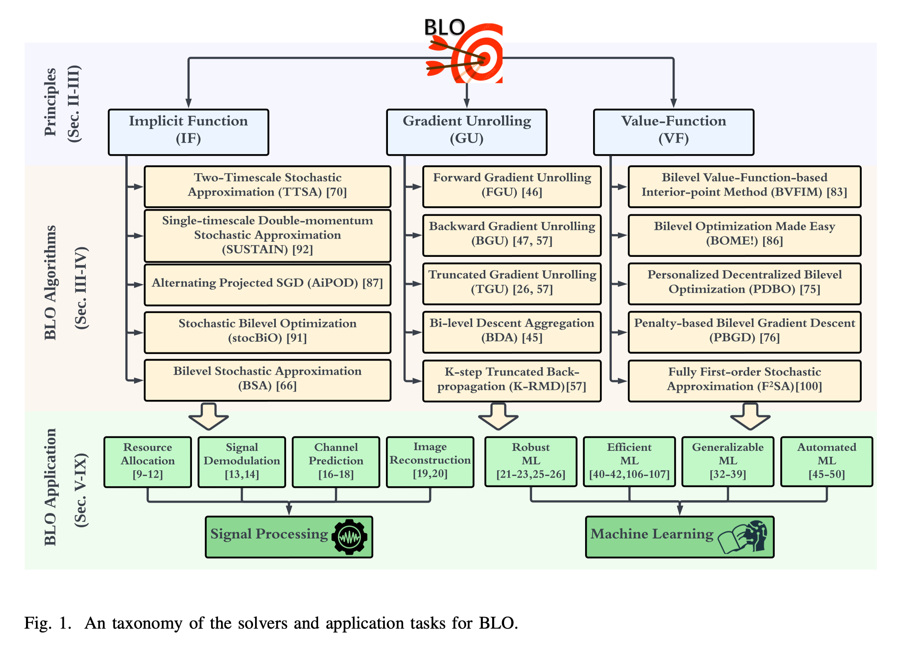

**Author**：Su Baozhuo, Institut Polytechnique de Paris 

**Date**：2025-07-01 

**Copyrights**：© 2025 Su Baozhuo, this file is only for academic purposes 

# Bilevel Optimization

This file shows the basic bilevel optimization theories used in this project based on the author's own comprehension, including :
- Introduction of Bilevel Optimization(BLO) problem
- Different algorithms that might be applied to BLO
- How BLO is applied to our project
- References

## I Introduction of BLO
Roughly speaking, BLO is a classical optimization that contains two levels of hierarchy(_i.e.,_ upper-level and lower level problem), the solution of upper-level problem will depend on the solution of lower-level one. Alternatively, the feasible region of upper-level is restricted by the lower-level.
BLO now has been applied to many differents fields, specially machine learning(ML) and signal processing(SP). For example, the classical BLO problem of _coreset selection_ problem could be formulated as:
$$
\begin{aligned}
\min_{w \in \mathcal{U}}\;&\ell_{\mathrm{val}}\bigl(\theta^*(w)\bigr) \\
\text{subject to}\;&\theta^*(w) \;=\;\arg\min_{\theta}\,\ell_{\mathrm{tr}}(\theta, w)\,.
\end{aligned}
$$

The above BLO is also related to datareweighting problem and hyperparameter optimization problem. Figure1 gives a overall review of BLO problems.

